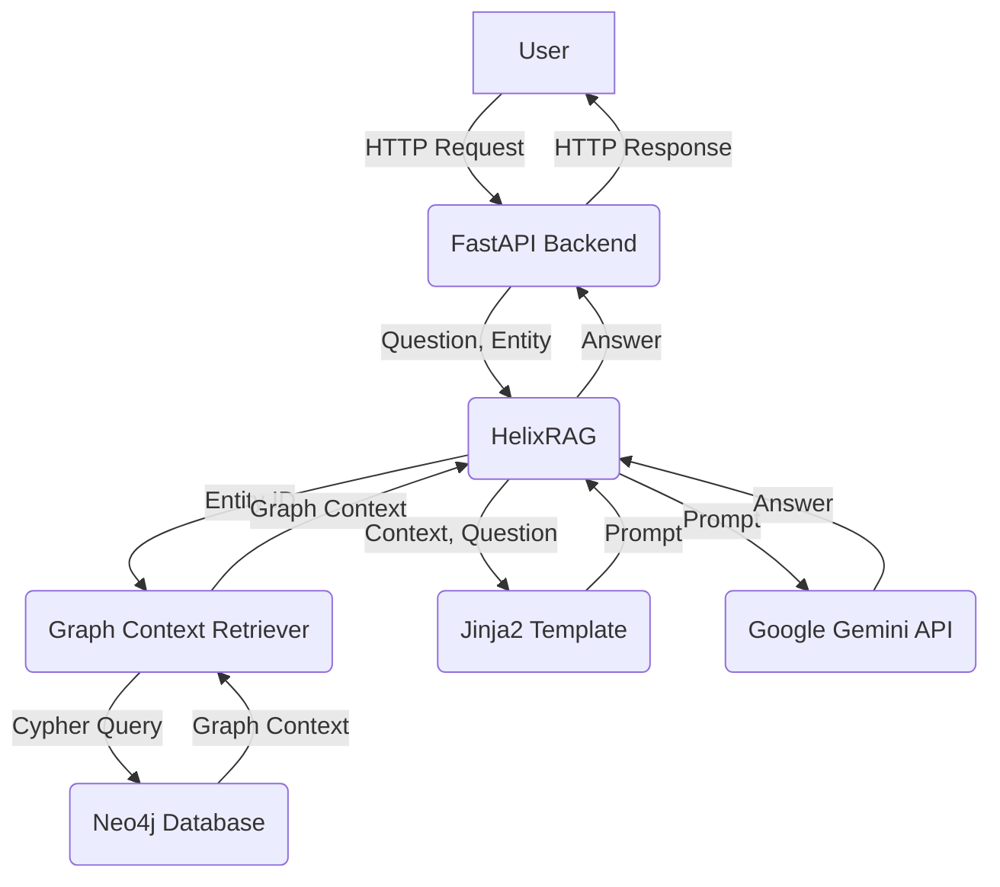

# HelixGraph RAG Architecture

This document outlines the architecture of the HelixGraph Retrieval-Augmented Generation (RAG) system.

## Overview

The HelixGraph RAG system is designed to answer natural language questions about the procurement and marketing data stored in the Neo4j graph database. It leverages the power of Google's Gemini large language model (LLM) to generate human-like answers based on the context retrieved from the graph.

The system is composed of the following key components:

1.  **FastAPI Backend**: A Python web server built using the FastAPI framework. It exposes a RESTful API for interacting with the RAG system.

2.  **Graph Context Retriever**: A module responsible for connecting to the Neo4j database and retrieving relevant context for a given entity (e.g., a supplier, a campaign).

3.  **HelixRAG**: The core component that orchestrates the RAG process. It takes a question and an entity as input, retrieves the context using the `GraphContextRetriever`, constructs a prompt using a Jinja2 template, and then uses the Gemini API to generate an answer.

4.  **Jinja2 Templates**: Templates used to structure the prompt that is sent to the Gemini API. These templates combine the retrieved context and the user's question into a single prompt.

5.  **Google Gemini API**: The LLM that generates the natural language answer based on the prompt.

## Architecture Diagram

## Workflow

1.  A user sends a POST request to the `/api/v1/rag/ask` endpoint of the FastAPI backend. The request body contains the natural language question, the entity type, and the entity ID.

2.  The FastAPI backend calls the `ask` method of the `HelixRAG` class.

3.  The `HelixRAG` class calls the appropriate method of the `GraphContextRetriever` class to retrieve the context for the given entity from the Neo4j database.

4.  The `GraphContextRetriever` runs a Cypher query against the Neo4j database to retrieve the context.

5.  The `HelixRAG` class uses a Jinja2 template to combine the retrieved context and the user's question into a single prompt.

6.  The `HelixRAG` class sends the prompt to the Google Gemini API.

7.  The Gemini API generates a natural language answer and returns it to the `HelixRAG` class.

8.  The `HelixRAG` class returns the answer to the FastAPI backend.

9.  The FastAPI backend returns the answer to the user in a JSON response.

## Example Q&A Pairs

Here are some examples of questions that can be answered by the HelixGraph RAG system:

*   **Supplier:** "What can you tell me about supplier X?"
*   **Supplier:** "What is the risk score of supplier Y?"
*   **Supplier:** "Which campaigns is supplier Z linked to?"
*   **Campaign:** "What was the budget for campaign A?"
*   **Campaign:** "Which suppliers were involved in campaign B?"

## Known Limitations

*   **Product context:** The RAG system does not currently support questions about products.
*   **Limited context:** The context retrieved from the graph is limited to the immediate neighbors of the entity. This means that the RAG system may not be able to answer questions that require a broader understanding of the graph.
*   **No memory:** The RAG system does not have any memory of past conversations. Each question is treated as a new conversation.

## Troubleshooting Guide

*   **500 Internal Server Error:** This error indicates a problem with the RAG API. Check the logs of the `uvicorn` server for more information.
*   **"No context found" error:** This error indicates that the entity ID you provided does not exist in the Neo4j database. Make sure you are using a valid ID.
*   **"Error generating answer from Gemini" error:** This error indicates a problem with the Gemini API. Check your API key and make sure you have enabled the Gemini API in your Google Cloud project.
