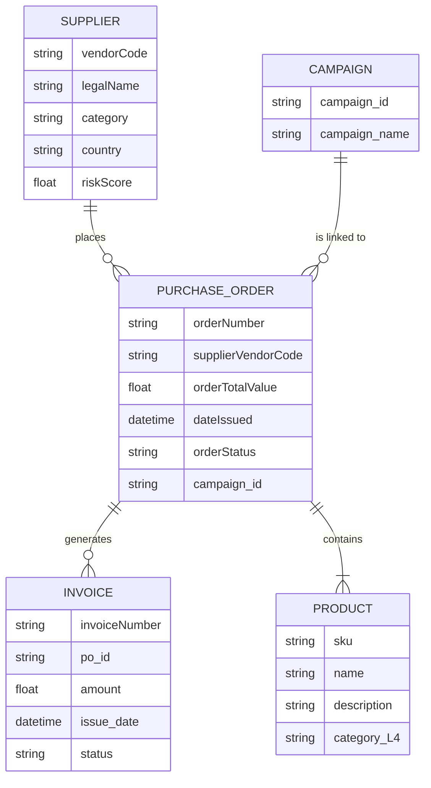

# Data Model Documentation - Sprint 2

This document provides a comprehensive overview of the data model for the procurement domain, as developed in Sprint 2.

## 1. Entity-Relationship Diagram (ERD)

Below is a Mermaid diagram illustrating the relationships between the core entities in the procurement data model.



## 2. Business Scenarios

This section describes key business scenarios that the data model supports.

### Scenario 1: Supplier Risk Assessment

- **Description:** Identify high-risk suppliers based on their risk score and country of origin.
- **Entities Involved:** `SUPPLIER`, `PURCHASE_ORDER`

### Scenario 2: Purchase Order Tracking

- **Description:** Track the status of purchase orders and their associated invoices.
- **Entities Involved:** `PURCHASE_ORDER`, `INVOICE`

### Scenario 3: Campaign Spend Analysis

- **Description:** Analyze the total spend on purchase orders that are linked to specific marketing campaigns.
- **Entities Involved:** `CAMPAIGN`, `PURCHASE_ORDER`

## 3. Example Cypher Queries

Here are some example Cypher queries that can be used to query the graph database.

### Query 1: Find all high-risk suppliers and their purchase orders.

```cypher
MATCH (s:SUPPLIER)-[:PLACES]->(po:PURCHASE_ORDER)
WHERE s.riskScore > 50
RETURN s.legalName, po.orderNumber, po.orderTotalValue
```

### Query 2: Find all purchase orders associated with a specific campaign.

```cypher
MATCH (c:CAMPAIGN {campaign_id: 'CAMP-001'})-[:IS_LINKED_TO]->(po:PURCHASE_ORDER)
RETURN po.orderNumber, po.orderTotalValue, po.orderStatus
```

### Query 3: Find all overdue invoices and their corresponding purchase orders and suppliers.

```cypher
MATCH (s:SUPPLIER)-[:PLACES]->(po:PURCHASE_ORDER)-[:GENERATES]->(i:INVOICE)
WHERE i.status = 'overdue'
RETURN s.legalName, po.orderNumber, i.invoiceNumber, i.amount, i.due_date
```
